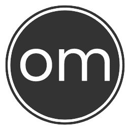

  

Organomania strives to present the world of organ and organ music to music enthusiasts, students and general public. It particularly focuses on significant organs in Czech Republic.

## Features
- categorizable and filterable view of significant organs, organ builders and organ music festivals in Czech Republic
- ability to add private organs and organ builders
- interactive building and inspecting of organ dispositions
- visual comparison of how a disposition changed across history
- ability to save registrations of specified organ pieces on any disposition
- filterable list of organ stops

## Tech stack
- Laravel 11 + Laravel Livewire 3
- Bootstrap 5.3
- MariaDB 10
- select2

## Running the app

Most easily with [Laravel Sail](https://laravel.com/docs/11.x/sail):

    # Run Docker containers
    sail up
    
    # Set up database
    sail artisan migrate:fresh --seed
    
    # Start Vite dev server
    sail npm run dev

